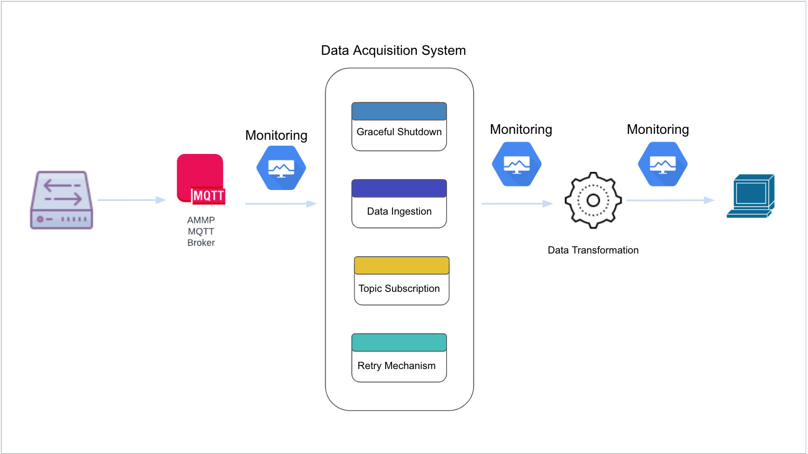

# Project Architecture
## Overview

This document provides an overview of the software architecture of the MQTT data acquisition and transformation project. The architecture is designed to handle data acquisition from various devices(energy equipment such as PV inverters or batteries) through MQTT, perform data transformation, and output the transformed data to the screen. Additionally, monitoring mechanisms are integrated to ensure the reliability and performance of the system. The architecture incorporates several components to achieve these goals.

## Project Structure

```
├── Dockerfile             # Docker configuration for containerization
├── README.md              # Project documentation
├── architecture.md        # Detailed explanation of the software architecture
├── ca-stage.crt           # TLS/SSL certificate file
├── src                    # Source code directory
│   ├── config_logging.py  # Logging configuration module
│   ├── main.py            # Entry point of the application
│   ├── mqtt_client.py     # MQTT client implementation
│   └── transform.py       # Data transformation module
├── requirements.txt       # Required Python packages
├── test                   # Unit tests directory
│   ├── __init__.py
│   ├── __pycache__
│   └── test_transform.py
├── monitoring             # Monitoring configuration
│   └── prometheus.yml     # Prometheus configuration for metrics monitoring
├── data                   # Example directory for storing data files from monitoring
│   ├── chunks_head
│   ├── queries.active
│   └── wal
└── venv                   # Virtual environment directory
    ├── bin
    ├── lib
    └── pyvenv.cfg
```

## Directory Structure

1. **Dockerfile**: Configuration file for building the Docker container.

2. **README.md**: Project documentation with information about setup, usage, and deployment.

3. **architecture.md**: A detailed explanation of the software architecture, workflow, and components.

4. **ca-stage.crt**: TLS/SSL certificate file for secure MQTT communication.

5. **config_logging.py**: Module to configure the logging system.

6. **main.py**: Entry point of the application.This is where the MQTT Client, logging and environment variables is called.

7. **mqtt_client.py**: MQTT client implementation for connecting to the MQTT broker and handling messages.

8. **requirements.txt**: List of required Python packages for the project.

9. **transform.py**: Module for transforming the MQTT payload data into structured format.

10. **test**: Directory containing unit tests for the project.

11. **monitoring**: Configuration directory for monitoring tools.

    - **prometheus.yml**: Prometheus configuration file for collecting and monitoring metrics.

12. **venv**: Virtual environment directory for isolating Python dependencies.

The project structure follows a modular approach, separating different components and functionalities for better organization, maintainability, and testability.

## Components


### MQTT Data Acquisition

1. **Dataloggers**: These are deployed at various sites to read data directly from energy equipments. They send the acquired data over MQTT to the main AMMP MQTT broker.

2. **MQTT Broker**: The main MQTT broker receives MQTT messages from dataloggers and facilitates their distribution to subscribers.

### MQTT Client

1. **Client**: The MQTT client connects to the MQTT broker to subscribe to a specific topic where data messages are published. The client is responsible for processing incoming MQTT messages.

2. **Message Transformation**: Upon receiving a message, the MQTT client invokes the `transform_payload` function to transform the payload data to a structured data pipeline format.
**transform_payload**: This module performs data transformation by parsing the JSON payload and extracting relevant information. The transformed data is structured and ready for display.

### Monitoring
1. **Processing Time Metric (processing_time)**:
This metric measures the time taken to process each incoming message. It's crucial for identifying how efficiently the MQTT client handles messages and for spotting any sudden increases in processing time.

2. **Message Counter Metric (message_counter)**:
The message counter metric keeps track of the total number of received messages. It helps understand the overall message throughput of the MQTT client and enables monitoring changes in message traffic.

3. **Error Counter Metric (error_counter)**:
This metric counts the total number of errors encountered during message processing and other operations. It gives insights into the MQTT client's stability and reliability by indicating the frequency of errors.

## High Level Workflow

1. Dataloggers collect data from energy equipment and send MQTT messages to the main AMMP MQTT broker.

2. The MQTT client subscribes to a specific topic on the broker to receive incoming messages.

3. Upon receiving an MQTT message, the client invokes the `transform_payload` function to convert the JSON payload into a structured data format.

4. The Transformed data is displayed on the screen, providing users with a clear view of the acquired and processed data.

5. Basic metrics are tracked using Prometheus to monitor the processing rate of messages,message throughput and error counter.


## Conclusion

The architecture of the MQTT data acquisition and transformation project efficiently handles data collection from the AMMP MQTT Broker, transformation of the data, and finally display of the data. By incorporating basic monitoring mechanisms, the system maintains reliability and provides efficient logging and monitoring to ensure observability and aids integrity of the data going to the data processing pipeline.

---


